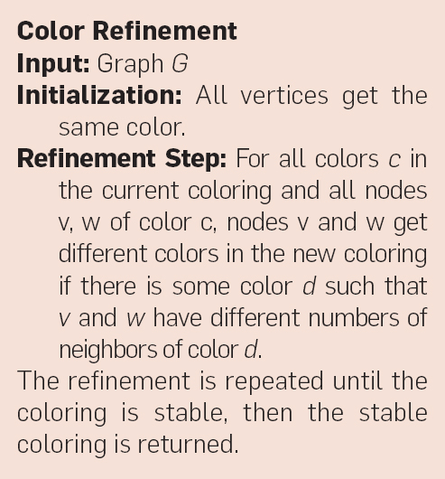

# UFABC Color Refinement - Discrete Mathematics 2


The algorithm is based on the following steps:



*Figure: The color refinement algorithm. Image adapted from the article by Martin Grohe and Pascal Schweitzer (see Reference section at the end of this document).*


To check if v and w have a different number of neighbors of color d, I created a map structure where the key is the node color together with the sorted colors of its neighbors. That way, I created a unique identifier (signature) for node structures.


After creating all node signatures, we change the colors of nodes with the same signature: the first color will be 1 and the next ones will be the previous color + 1.


To check if the graph is stable, we check if no node color has changed.


To check if both graphs are isomorphic, I created a histogram using a map structure, where the key is the node color and the value is the quantity of that color. If both histograms are equal, the graphs are isomorphic.


It is important to note that this algorithm is not 100% perfect and there are cases where the result is incorrect. More information about this is in the reference section.


## Tutorial: How to Run


To compile and run the program, use the following command in your terminal:

```bash
g++ color_refinement.cpp -o result.out && ./result.out < Base_dados_Problema_Grafos_Isomórficos.txt
```


This command compiles the `color_refinement.cpp` source file using the `g++` compiler, producing an executable named `result.out`. The program is then executed, taking its input from the file `Base_dados_Problema_Grafos_Isomórficos.txt`. The program processes this file to solve instances of the graph isomorphism problem using the color refinement algorithm.


**Note:** You need to have `g++` installed on your system. If you do not have it, you can install it using your package manager (for example, `sudo apt install g++` on Ubuntu/Debian).

## Output

```
1) n = 10 +++ 0.000
2) n = 12 +++ 0.000
3) n = 17 +++ 0.000
4) n = 20 +++ 0.000
5) n = 30 +++ 0.000
6) n = 20 +++ 0.000
7) n = 25 +++ 0.000
8) n = 25 +++ 0.000
9) n = 40 +++ 0.000
10) n = 11 +++ 0.000
11) n = 35 +++ 0.000
12) n = 28 +++ 0.000
13) n = 64 +++ 0.000
14) n = 77 +++ 0.000
15) n = 35 +++ 0.000
16) n = 45 +++ 0.000
17) n = 45 +++ 0.000
18) n = 45 +++ 0.000
19) n = 45 +++ 0.000
20) n = 13 +++ 0.000
21) n = 34 +++ 0.000
22) n = 34 +++ 0.000
23) n = 34 +++ 0.000
24) n = 25 +++ 0.000
25) n = 14 +++ 0.000
26) n = 40 +++ 0.000
27) n = 40 +++ 0.000
28) n = 40 +++ 0.000
29) n = 16 +++ 0.000
30) n = 25 +++ 0.000
31) n = 18 +++ 0.000
32) n = 36 +++ 0.001
33) n = 20 +++ 0.000
34) n = 40 +++ 0.000
35) n = 40 +++ 0.000
36) n = 40 +++ 0.000
37) n = 21 +++ 0.000
38) n = 8 +++ 0.000
39) n = 3 --- 0.000
40) n = 4 +++ 0.000
```

## Reference


This project is inspired by the following article:

**The Graph Isomorphism Problem**  
Exploring the theoretical and practical aspects of the graph isomorphism problem.  
By Martin Grohe and Pascal Schweitzer  
Posted Nov 1 2020  
Available at: [https://cacm.acm.org/research/the-graph-isomorphism-problem/](https://cacm.acm.org/research/the-graph-isomorphism-problem/)

Additional references:

- [A visual demo of the color refinement algorithm (GitHub)](https://github.com/holgerdell/color-refinement/tree/master)
- [Pairs of tough graphs for the graph isomorphism testing](https://funkybee.narod.ru/graphs.htm)

## About


This project is part of the course Discrete Mathematics 2 at UFABC (Universidade Federal do ABC).